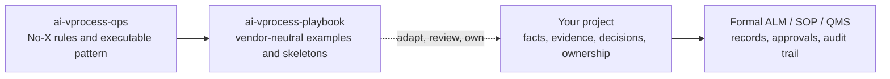

# AI V-Process Playbook

Abstract patterns are easy to misapply. This playbook shows what reviewable
AI-assisted engineering can look like when project work must pass through ALM,
SOP, or QMS-style review without pretending that an example is an approval.

This is the applied-example companion to
[ai-vprocess-ops](https://github.com/enzoferraripapa-arch/ai-vprocess-ops). It
shows how the abstract pattern can look when applied to V-process and ALM-style
operations without tying the examples to a specific vendor tool.

Use this repository like a map, not like a permit. The examples help structure
project profiles, work-item-like records, review gates, trace candidates,
connector permissions, and routing matrices. They do not approve a product,
prove compliance, certify safety, authorize a connector, or replace competent
engineering judgement.



## What This Contains

- vendor-neutral ALM operating examples;
- project profile pattern;
- work-item and SOP skeleton pattern;
- gate and trace review example;
- connector permission boundary example;
- small routing matrix example;
- common knowledge pack layout and update workflow;
- adoption starter pack for new project repositories;
- Review Brief generation for small human-facing review packets;
- one worked fictional scenario;
- public-safety check for accidental private material.

## What This Is Not

- a full ALM implementation;
- a formal adapter for any vendor tool;
- legal, regulatory, safety, cybersecurity, privacy, or quality advice;
- evidence that your product is safe, compliant, approved, or ready to release;
- permission to use unauthorized source code, documents, logs, or third-party
  material.

## Read First

1. [docs/01_companion_relationship.md](docs/01_companion_relationship.md)
2. [docs/00_no_x_rules_quickref.md](docs/00_no_x_rules_quickref.md)
3. [docs/08_alm_vocabulary_mapping.md](docs/08_alm_vocabulary_mapping.md)
4. [docs/03_project_profile_pattern.md](docs/03_project_profile_pattern.md)
5. [docs/09_knowledge_pack_architecture.md](docs/09_knowledge_pack_architecture.md)
6. [docs/10_adoption_starter_pack.md](docs/10_adoption_starter_pack.md)
7. [docs/07_routing_matrix_example.md](docs/07_routing_matrix_example.md)
8. [docs/05_gate_trace_review_example.md](docs/05_gate_trace_review_example.md)
9. [docs/06_connector_permission_example.md](docs/06_connector_permission_example.md)
10. [docs/04_work_item_sop_skeleton.md](docs/04_work_item_sop_skeleton.md)
11. [docs/02_responsibility_boundary.md](docs/02_responsibility_boundary.md)
12. [examples/scenarios/01_firmware_update_walkthrough.md](examples/scenarios/01_firmware_update_walkthrough.md)

## Examples

- [examples/sample_project_profile.json](examples/sample_project_profile.json)
- [examples/sample_work_item_sop_skeleton.md](examples/sample_work_item_sop_skeleton.md)
- [examples/sample_routing.json](examples/sample_routing.json)
- [examples/starter_project/.aivprocess/knowledge_pack_lock.json](examples/starter_project/.aivprocess/knowledge_pack_lock.json)
- [templates/starter_repo/.aivprocess/requirements.json](templates/starter_repo/.aivprocess/requirements.json)
- [templates/starter_repo/.aivprocess/reuse_assessment.json](templates/starter_repo/.aivprocess/reuse_assessment.json)
- [examples/knowledge_packs/](examples/knowledge_packs/)
- [templates/starter_repo/](templates/starter_repo/)
- [examples/scenarios/01_firmware_update_walkthrough.md](examples/scenarios/01_firmware_update_walkthrough.md)

## Tiny Tools

Render the sample routing matrix as Markdown:

```bash
python tools/render_routing.py examples/sample_routing.json
```

Inspect the example knowledge-pack update plan without changing the project lock.
The public examples are documentation fixtures; real adoption checks should point
to a private `knowledge-packs/` directory containing actual `knowledge.db` files.

```bash
python tools/knowledge_pack.py plan --project examples/starter_project --packs examples/knowledge_packs
```

Create a starter layout for a new product repository:

```bash
python tools/create_starter_project.py --target ../my-product-repo
cd ../my-product-repo
python tools/init_project_db.py
python tools/record_local_handoff.py \
  --reviewer example-reviewer \
  --decision-rationale "Local reviewer accepted this record for handoff rehearsal."
python tools/export_handoff.py
python tools/generate_review_brief.py --record-db
```

## Safety Gate

Before publishing or changing examples, run:

```bash
python tools/check_public_safety.py
```

The gate rejects common publication accidents such as committed databases,
private paths, internal hostnames, obvious credentials, and private-source
markers.

Last refresh: 2026-05-21. Next planned review: 2026-08.
